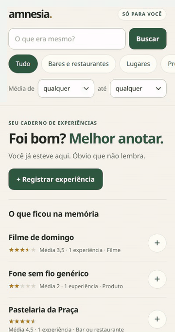

# amnesia

Registro pessoal de lugares, produtos e experiências. Aplicativo privado, para uma
pessoa; repositório de código público durante a avaliação da disciplina.

[Boas práticas](BOAS_PRATICAS.md) descreve as convenções de código, documentação e
testes. Nesta fase, os commits vão direto para `main`.



Gravação do app rodando no computador, com dados fictícios: registrar uma experiência
com nota, pedido, preço, tags, endereço e telefone, encontrá-la pela busca e abrir a
página do item, com os botões **Ligar** e **WhatsApp**.
A gravação é refeita por `make demo` ([`scripts/demo.cjs`](scripts/demo.cjs)), que usa
um banco isolado.

## Conteúdo

- [O que funciona agora](#o-que-funciona-agora--incremento-5)
- [Rodar no seu computador](#rodar-no-seu-computador-linux)
- [Testes de navegador e integração real](#testes-de-navegador-e-integração-real)
- [Integração contínua](#integração-contínua)
- [Organização e decisões técnicas](#organização-e-decisões-técnicas)
- [Publicação](#publicação)
  - [Publicar a sua própria instância](#publicar-a-sua-própria-instância)
- [Tecnologias e ferramentas](#tecnologias-e-ferramentas)
- [Como a IA foi usada](#como-a-ia-foi-usada)
- [Limitações e próximos passos](#limitações-e-próximos-passos)
- [Versões](#versões)
- [Créditos e licença](#créditos-e-licença)

## O que funciona agora — incremento 5

- Registrar itens em sete categorias: **Bares e restaurantes**, **Lugares** (cidades,
  passeios, turismo), **Produtos**, **Filmes**, **Séries**, **Livros** e **Música**.
  Só o nome exige digitação; cada categoria tem seus próprios detalhes (endereço e
  telefone, direção e ano, autoria e editora, artista e álbum…).
- Guardar só o item ou já registrar uma experiência na mesma tela.
- Registrar outras experiências em um item existente.
- Escolher notas de **0 a 5 em passos de meia estrela**, por toque ou teclado.
  “Sem nota” é diferente de zero.
- Escrever a descrição do item e o relato de cada experiência separadamente.
- Informar data, pedido/provado, preço e tags.
- Responder “Voltaria / compraria de novo?” numa escala: Sem sombra de dúvidas,
  Voltaria ué, Talvez, Uai sei não, Não por livre espontânea vontade ou Nem a pau,
  Juvenal! “Sem resposta” é diferente de qualquer uma delas.
- Guardar telefone/WhatsApp de bares, restaurantes e lugares. A página deles oferece
  **Ligar** e **WhatsApp**.
- Anexar até 3 fotos por experiência. O navegador reduz para até 1600 pixels no
  maior lado e 768 KiB por foto, converte para JPEG e remove os metadados.
- Consultar os itens por categoria e registrar outra experiência a partir deles.
- Manter o índice FTS atualizado na mesma transação do cadastro.
- **Buscar** pelo campo no topo de qualquer página: nome, descrição do item, relatos,
  pedidos, tags, endereço, bairro, cidade e detalhes do produto. Um item aparece uma
  vez, mesmo com várias experiências que mencionem o termo; o trecho encontrado fica
  destacado.
- Filtrar por categoria e por faixa de **nota média do item** (0 a 5, meia em meia).
- Cada aba de categoria tem seu botão **+ Registrar**, que já abre o formulário
  naquela categoria.
- **Editar** o item (nome, categoria, descrição e detalhes) e cada experiência
  (nota, relato, data, pedido, preço, tags e “voltaria?”). A busca acompanha.
- **Excluir** um item inteiro, uma experiência ou uma foto, sempre com uma tela de
  confirmação que diz o que vai junto.
- **Instalar no celular**: no Chrome do Android, ⋮ → **Adicionar à tela inicial**. O
  app ganha ícone próprio e abre em tela cheia, sem a barra do navegador.

Tocar no nome de um item abre a página dele: **nota média** em estrelas, resumo do
“Voltaria?” (quantas respostas foram sim e qual foi a última), descrição, endereço,
contatos e as experiências da mais recente para a mais antiga, com a miniatura da
primeira foto. Cada experiência abre na própria página, com tudo o que foi anotado.
O app está publicado em <https://amnesia.juliopatti.workers.dev>, fechado por senha.
Veja [Publicação](#publicação).

## Rodar no seu computador (Linux)

Execute os blocos **um por vez**, no terminal aberto na pasta que contém este
README. Se um comando falhar, pare nesse passo e copie a mensagem de erro sem
segredos. Nenhum destes passos altera sua conta Cloudflare.

Cada passo tem um atalho no `Makefile`: `make instalar`, `make testar`, `make banco`,
`make senha` e `make rodar`. `make` sozinho lista todos, incluindo `make e2e`,
`make diagrama`, `make demo` e `make publicar`.

### 1. Confira as ferramentas

```bash
python3 --version
node --version
uv --version
```

Python 3.12 ou mais recente serve para os testes offline. O ambiente validado usa
Node 22.23.2. Node executa as ferramentas de desenvolvimento: o backend continua
em Python e o frontend não tem build.

Se aparecer `uv: command not found`, instale pelo instalador oficial:

```bash
curl -LsSf https://astral.sh/uv/install.sh -o /tmp/amnesia-instalar-uv.sh
sh /tmp/amnesia-instalar-uv.sh
```

Reabra o terminal na pasta do projeto e confira `uv --version` novamente.
[Instalação oficial do uv](https://docs.astral.sh/uv/getting-started/installation/).

### 2. Instale as ferramentas do projeto

```bash
uv sync --locked
npm ci
```

O uv cria `.venv/`. O pywrangler pode criar `.venv-workers/` e baixar o Python do
runtime Cloudflare automaticamente. Isso não substitui o Python do sistema.
O npm instala Wrangler, Playwright, Mermaid e ffmpeg nas versões do `package-lock.json`.
Não é necessário ativar ambientes virtuais manualmente.

A aplicação usa a SDK oficial de Workers e uma cópia local do **htmx 2.0.8**
([licença](static/htmx.LICENSE)). Playwright serve aos testes de navegador e, com o
Mermaid, à geração do diagrama de arquitetura; Wrangler é a ferramenta oficial de
desenvolvimento. Não há ORM, framework web,
biblioteca de processamento de imagens ou dependência de CDN.

### 3. Execute os testes offline

```bash
PYTHONPATH=src python3 -m unittest discover -s tests -v
```

Resultado esperado: **103 testes e `OK`**. Esta suíte usa apenas a stdlib,
não faz chamadas de rede e pode rodar mesmo sem as instalações do passo 2.

### 4. Prepare ou atualize o banco local

```bash
uv run pywrangler d1 migrations apply amnesia --local
```

Responda `y` se houver confirmação. O comando aplica só as migrações que faltam.
Rode de novo sempre que atualizar o código: sem a migração nova, o app falha ao
gravar.

A `0004_categorias.sql` move os itens de “Lugar” para “Bares e restaurantes”, que era o
uso até então; “Lugares” passa a ser para cidades e turismo. Os detalhes não mudam.
A `0003_voltaria.sql` converte as respostas antigas: **Sim** vira “Voltaria, ué” e
**Não** vira “Não por livre espontânea vontade”; sem resposta continua sem resposta.
Antes de aplicá-la sobre dados reais, faça uma cópia:

```bash
cp -r .wrangler/state .wrangler/state-copia-$(date +%Y%m%d-%H%M)
```

`--local` guarda o banco em `.wrangler/state/`. O identificador com zeros em
`wrangler.jsonc` é proposital para esta fase. Não precisa criar D1 no painel.
O R2 local também é simulado pela ferramenta, sem conta ou assinatura.

### 5. Crie a senha do app local

O app pede senha em todas as páginas. Crie a do computador uma vez:

```bash
python3 scripts/senha.py --dev-vars
```

Digite uma senha de 12 caracteres ou mais, duas vezes; ela não aparece na tela.
O script grava em `.dev.vars` (ignorado pelo Git) só o hash da senha e um segredo de
sessão. Pode ser a mesma senha da versão publicada ou outra.

### 6. Ligue o app

```bash
uv run pywrangler dev
```

Espere aparecer `Ready on http://localhost:8787` ou o endereço informado pela
ferramenta. Abra <http://localhost:8787> no navegador do computador, entre com a
senha do passo 5 e mantenha o terminal aberto. A sessão dura 30 dias; **Sair** fica
no rodapé. Pressione **Ctrl+C** quando quiser desligar. Os dados permanecem.

Se a porta estiver ocupada, use `uv run pywrangler dev --port 8788` e abra a porta
8788. Se o app mostrar erro de banco, confira o passo 4 e reinicie o servidor. Se mostrar
“O login ainda não foi configurado”, faça o passo 5 e reinicie.
A instalação inicial das ferramentas e do runtime precisa de internet.

### 7. Experimente o cadastro, a busca e a edição

1. Clique em **Registrar experiência**.
2. Digite um nome, por exemplo “Bar de teste”.
3. Toque na metade esquerda de uma estrela para meia estrela, ou na direita para
   a estrela inteira. **0 estrelas** e **Sem nota** têm opções próprias.
4. Escreva “Coxinha fria” no campo **Como foi?**.
5. Se quiser, abra **Mais detalhes** ou escolha uma foto.
6. Clique em **Guardar experiência**. Deve aparecer “Pode esquecer. A gente anotou.”
7. Clique em **Outra experiência aqui** para registrar uma segunda visita no mesmo item.

Depois, na página inicial:

1. Digite `coxinha` no campo do topo. O bar aparece uma vez, com “Coxinha”
   destacado no relato — mesmo que o nome do bar não tenha essa palavra.
2. Troque por `COXINHA` ou `coxínha`: maiúsculas e acentos não importam. Plural e
   diminutivo também não: `espetinho` encontra “espeto”, e vice-versa.
3. Escolha uma categoria, como **Bares e restaurantes** ou **Produtos**, e uma faixa
   em **Média de … até …**.
   Com JavaScript, os resultados mudam sem recarregar; sem ele, use **Buscar**.
4. Teste entradas estranhas, como `"NOT (` ou `!!!`: a busca responde com uma
   mensagem, nunca com erro. **Limpar busca** volta à lista completa.

Para corrigir algo:

1. Na lista, toque no **nome** do item. A página mostra o item e as experiências.
2. **Editar item** muda nome, categoria, descrição e detalhes. **Excluir item** apaga o
   item com todas as experiências e fotos, depois de mostrar o que vai junto.
3. Toque numa experiência e use **Editar experiência** ou **Excluir**.
4. Sob cada foto há **Remover foto**. Nada é apagado sem a tela “Excluir de vez”.
5. Busque pelo nome antigo e pelo novo: só o novo deve aparecer.

Se apagar a data ao editar, a original é mantida. Ainda não é possível mover uma
experiência para outro item.

Para cadastrar apenas um item, preencha o nome e use **Só guardar o item, sem
experiência**. A descrição do item fica em **Mais detalhes**. Fotos pertencem às
experiências, por isso exigem o botão **Guardar experiência**.

Se a foto falhar, o texto já estará salvo. A tela oferece **Tentar fotos novamente**
ou um link para continuar com o registro salvo. Também é possível anexar fotos na
página de confirmação posteriormente. Uma foto que o navegador não consiga abrir
(por exemplo, certos arquivos HEIC) deve ser exportada para JPEG, PNG ou WebP.

Sem JavaScript, cadastro, edição, exclusão e seleção de nota continuam funcionando; a redução e o
envio de fotos precisam de JavaScript. Os detalhes de todas as categorias ficam
visíveis nesse modo, mas o servidor usa somente os da categoria selecionada.

## Testes de navegador e integração real

Depois dos passos 1 e 2, instale o navegador de testes uma vez:

```bash
npx playwright install chromium
```

Se o Playwright indicar bibliotecas do sistema ausentes, execute
`npx playwright install --with-deps chromium`; essa variante pode pedir sua senha
para instalar pacotes do sistema.

Prepare o banco isolado e execute os testes:

```bash
uv run pywrangler d1 migrations apply amnesia --local --persist-to .wrangler/test-state
npm run test:e2e
```

O Playwright inicia e encerra o Worker na porta **8790**, usando D1 e R2 locais em
`.wrangler/test-state/`. O Worker de teste recebe uma senha fictícia pela
configuração do Playwright, e todos os cenários entram com ela antes de começar. A porta precisa estar livre. Seus registros de desenvolvimento
em `.wrangler/state/` não são usados. Os dados fictícios podem permanecer entre
execuções; os testes geram nomes únicos.

Para usar o Chrome já instalado no Linux, em vez do Chromium baixado:

```bash
PLAYWRIGHT_CHROMIUM_EXECUTABLE_PATH=/usr/bin/google-chrome npm run test:e2e
```

Os 11 cenários verificam login (páginas, fotos e envios protegidos, senha errada, volta
ao destino e saída), cadastro, meia estrela/zero/ausência, teclado, produto,
campos preservados após erro, htmx, cadastro sem JavaScript, escape de HTML, redução
real de imagem, falha e repetição de upload, leitura da foto no R2, proteção de
origem, reenvio concorrente, busca (relato, acentos, filtros, htmx, entradas especiais
e estados vazios), categorias com detalhes próprios e filtro, edição com e sem
JavaScript refletida na busca, exclusão de
experiência e de foto com confirmação, layout mobile sem rolagem horizontal e todas
as categorias visíveis no computador.

Em caso de falha, capturas e traces ficam em `test-results/`, ignorado pelo Git.
Esses arquivos podem conter o conteúdo usado no teste; use somente dados fictícios.

## Integração contínua

A aba [Actions → Testes](https://github.com/juliopatti/Amnesia/actions/workflows/testes.yml)
mostra as execuções de cada push. O workflow configura:

- Suíte offline em Python 3.12 e 3.14.
- Testes de navegador com Chromium, Python Worker, D1 e R2 locais.

Não exige segredos Cloudflare e não realiza deploy. As dependências são baixadas
na preparação do runner; os testes do app usam apenas recursos locais.

Um segundo workflow, [Diagrama](https://github.com/juliopatti/Amnesia/actions/workflows/diagrama.yml),
roda só quando `docs/arquitetura.mmd` ou `scripts/diagrama.cjs` mudam no `main`. Ele gera
`docs/arquitetura.svg` e, se a imagem mudou, registra um commit do `github-actions[bot]`.
É o único workflow com permissão de escrita no repositório. Depois dele, faça `git pull`
antes do próximo push.

Validação do incremento 5: **103 testes offline e 11 cenários de navegador aprovados**,
localmente e no GitHub Actions. O CI não usa a conta Cloudflare nem o Google; o que foi
validado na publicação real está em [Publicação](#publicação). Não houve teste em
Safari/iPhone.

## Organização e decisões técnicas



O Worker recebe cada requisição, confere a sessão e chama um serviço; o serviço valida
com as regras do domínio e grava pelo armazenamento, que o Worker cria e entrega pronto.
A resposta é HTML montado no servidor.

O diagrama é escrito em Mermaid em [`docs/arquitetura.mmd`](docs/arquitetura.mmd). Ao alterar
esse arquivo, o workflow [Diagrama](.github/workflows/diagrama.yml) gera a imagem de novo e a
registra no `main`. Para gerar no computador, use `npm run diagrama`.

| Arquivo | Responsabilidade |
| --- | --- |
| `src/dominio.py` | Validações, normalizações e montagem segura da consulta de busca |
| `src/servicos.py` | Buscar, criar, editar e excluir; dependências injetadas |
| `src/armazenamento.py` | SQL parametrizado, transações D1, projeção e consulta FTS, fotos no R2 local ou no Google Drive |
| `src/acesso.py` | Hash da senha, sessão assinada e destino seguro após o login |
| `src/worker.py` | Rotas HTTP, limites de corpo e checagem de origem |
| `src/paginas.py` | HTML com escape de valores |
| `static/` | CSS, ícone da seta dos selects, htmx local, JavaScript de formulário/fotos, e manifest e ícones do app instalável |
| `migrations/` | Evolução do esquema sem reescrever migrações anteriores |
| `tests/` | Regras, serviços com dublês, SQL real em SQLite e testes de navegador |
| `scripts/` | Senha do login, autorização do Google Drive, migração dos dados locais e geração do diagrama e do GIF |
| `docs/` | Prompt inicial, fonte e imagem do diagrama de arquitetura e GIF de demonstração |
| `Makefile` | Atalhos para os comandos deste README |

O item contém nome, descrição e detalhes em JSON por categoria. `CATEGORIAS`, em
`src/dominio.py`, é a fonte única de nomes, ordem e campos: o formulário, os filtros
e a página do item são gerados a partir dela. A tabela `categorias` guarda os mesmos
slugs só para a integridade referencial, e um teste garante que as duas batem. Nova
categoria = entrada em `CATEGORIAS` + migração inserindo o slug; nenhuma tabela muda.

Subcategorias (Música → Rock, Blues…) já são suportadas pelo desenho, embora nenhuma
exista: o slug usa a raiz como prefixo (`musica.rock`), herda os campos dela e
aparece ao filtrar pela raiz. Para criar uma, basta inserir o slug e o nome na tabela.
Nos formulários, cada campo de detalhe leva a categoria no nome (`restaurante-bairro`),
para que categorias com os mesmos campos não gerem ids ou nomes repetidos. Experiências têm data, nota opcional, relato,
pedido, preço em centavos de reais, “voltaria?” de 0 (Nem a pau) a 5 (Sem sombra de
dúvidas) ou nulo, e tags. O telefone fica nos detalhes do lugar. Com DDD, o app
assume +55 para o WhatsApp; sem DDD ou 0800, oferece só a ligação.

As chaves de envio evitam duplicação ao repetir um formulário: **o primeiro envio
confirmado prevalece**. Para registrar outra experiência, abra um novo formulário.
A gravação do item, experiência, tags e documento FTS ocorre em um único
`D1.batch`. Se uma etapa falha, o lote é desfeito. A FTS agrega nome, descrição,
localização, detalhes, relatos, pedidos e tags, com um documento por item.

A busca reduz cada palavra a um radical simples do português, sem diminutivo, plural
e vogal final (`espetinhos` → `espet`), e procura esse radical como prefixo entre
aspas (`"espet"*`), exigindo todas as palavras. Radicais curtos demais não são
cortados, para `caminho` não virar `cam`; em troca, `bolinho` e `bolo` continuam
separados. Não é um stemmer completo nem usa dependência externa. Como
cada palavra fica entre aspas, `*`, parênteses e `AND`/`OR`/`NOT`/`NEAR` viram texto
comum, e a consulta à FTS nunca fica malformada. O tokenizador `unicode61
remove_diacritics 2`, já existente, ignora acentos e maiúsculas; não houve migração.
Texto sem nenhuma letra ou número mostra um aviso em vez de listar tudo. O limite é
200 caracteres e 10 palavras. Os resultados são ordenados por relevância (bm25, com
peso maior para o nome).

A média usa só experiências avaliadas: zero conta, “sem nota” não. Com qualquer
limite de nota, itens sem avaliação ficam fora; sem limite, aparecem. A faixa compara
a média exata, exibida com até duas casas. Filtros inválidos (por exemplo, mínimo
maior que o máximo) retornam 422 com a mensagem na própria página; o htmx foi
configurado para exibir essa resposta. A média é calculada a cada consulta, o que
serve para um caderno pessoal; o desempenho com muitos registros ainda será medido.

Fotos usam uma segunda requisição. No computador e nos testes ficam no R2 simulado; na
publicação, sem o binding `FOTOS`, vão para a pasta do Google Drive. O banco guarda em
`fotos.arquivo` a referência devolvida pelo armazenamento (a chave no R2, o id no Drive).
Se dois envios iguais chegarem juntos, o Drive cria dois arquivos: fica o primeiro
registrado e o outro é apagado. O armazenamento de fotos e o D1 não têm transação conjunta: se a gravação
dos metadados falha, o serviço tenta remover o objeto enviado. Falha simultânea do
D1 e do armazenamento pode deixar arquivo órfão; reconciliação automática ainda não está implementada.
Na exclusão, o banco é alterado primeiro, num único lote com a FTS, e só depois o
arquivo sai do armazenamento. Se ele falhar, a foto já some do app, mas o arquivo privado fica
órfão (no R2 ou no Drive) e o Worker registra só a quantidade no log. As exclusões removem
fotos, tags e experiência explicitamente, sem depender de `ON DELETE CASCADE`.
A edição substitui os campos e as tags e reindexa o item no mesmo `D1.batch`.

O servidor limita tamanho, quantidade e verifica MIME/assinatura JPEG. Não é uma
validação completa por decodificação de imagem no servidor.

As escritas exigem `Origin` igual ao site e rejeitam requisições marcadas como
cross-site. SQL usa parâmetros, HTML usa escape e respostas incluem CSP e
`nosniff`. Fotos são servidas pelo Worker, só com sessão; nada fica público no Drive.

Todas as páginas, fotos e envios exigem login, exceto `/entrar`, `/privacidade`, `/saude`
(que sem sessão só diz se o banco responde) e os arquivos estáticos. A senha fica no
segredo `SENHA_HASH` como PBKDF2-SHA256 com 100 mil iterações e sal aleatório.
`hashlib.pbkdf2_hmac` **não existe** nos Python Workers (conferido no runtime), então o
Worker usa o PBKDF2 do WebCrypto, que dá o mesmo resultado; os testes e
`scripts/senha.py` usam hashlib. A sessão é um cookie `HttpOnly`, `SameSite=Lax` e
`Secure` (em https) com validade e assinatura HMAC; vale 30 dias. Trocar
`SEGREDO_SESSAO` encerra todas as sessões. Dez senhas erradas em 15 minutos bloqueiam
o login por 15 minutos; como o app é de uma pessoa, o bloqueio vale para todos. Sem os
segredos, o app fica fechado, nunca aberto. Depois do login, o destino só pode ser
um caminho deste site.

Stdlib usada no runtime: `base64`, `datetime`, `decimal`, `hashlib` (só SHA-256),
`hmac`, `html`, `json`, `re`, `time`, `urllib.parse` e `uuid`. Compatibilidade conferida na [documentação de Python Workers](https://developers.cloudflare.com/workers/languages/python/stdlib/)
e exercitada no runtime local. Horários usam offset fixo `-03:00`, sem `zoneinfo`.
SQLite e dublês ajudam a testar SQL e falhas, mas não substituem a integração real.

## Publicação

O app roda em <https://amnesia.juliopatti.workers.dev>, só com serviços que não pedem
cartão (conferido na documentação de cada um):

| Parte | Serviço |
| --- | --- |
| App e textos | Cloudflare Workers + D1, plano gratuito |
| Fotos | Pasta privada `amnesia-fotos` no Google Drive do dono, pela API do Drive |
| Login | Senha própria (acima), segredos do Worker |
| Endereço | `workers.dev`, gratuito |

R2 e Cloudflare Access, do plano original, exigem cartão mesmo no plano gratuito e
foram descartados. O R2 continua só como simulação local para desenvolvimento e testes.

A configuração de publicação é o ambiente `producao` do `wrangler.jsonc`: outro D1, sem
R2 e com `workers_dev` ligado. Sem `--env producao`, todos os comandos continuam locais.
O `database_id` de zeros da configuração principal não deve mudar: o banco local em
`.wrangler/state` depende dele.

### Publicar a sua própria instância

Os passos abaixo, nesta ordem, levam de um clone do repositório a um amnesia seu, com a
sua conta Cloudflare, a sua senha e o seu Google Drive. Faça antes os passos 1 e 2 de
[Rodar no seu computador](#rodar-no-seu-computador-linux). O roteiro foi montado a partir
da publicação do autor; ainda não foi seguido do zero por outra pessoa.

**1. Entre na Cloudflare.** Crie uma conta gratuita em <https://dash.cloudflare.com/sign-up>
(não pede cartão) e autorize o Wrangler:

```bash
npx wrangler login
```

**2. Crie o seu banco.**

```bash
npx wrangler d1 create amnesia
```

Se o Wrangler oferecer para alterar a configuração por você, responda **não**: ele
escreveria na parte local do arquivo. Copie o `database_id` que o comando mostra.

**3. Aponte a configuração para o seu banco.** Em `wrangler.jsonc`, dentro de
`env.producao`, troque o `database_id` pelo seu. O que está no repositório é o da
instância do autor e só funciona na conta dele. Esse identificador não é segredo.

**4. Crie as tabelas e publique.**

```bash
uv run pywrangler d1 migrations apply amnesia --remote --env producao
uv run pywrangler deploy --env producao
```

No primeiro deploy, a Cloudflare pede para você escolher o subdomínio da conta. O app
fica em `https://amnesia.SEU-SUBDOMINIO.workers.dev`. Ele ainda não tem senha, por isso
responde “O login ainda não foi configurado” — fechado, nunca aberto.

**5. Crie a senha.**

```bash
python3 scripts/senha.py | npx wrangler secret put SENHA_HASH --env producao
python3 -c "import secrets;print(secrets.token_urlsafe(32))" | npx wrangler secret put SEGREDO_SESSAO --env producao
```

A partir daqui dá para entrar e registrar experiências sem foto.

**6. Prepare o Google Drive.** No [Google Cloud Console](https://console.cloud.google.com/),
com a conta dona do Drive:

1. Crie um projeto, sem conta de faturamento.
2. Em **APIs e serviços → Biblioteca**, procure a **Google Drive API** e clique em **Ativar**.
3. Em **Google Auth Platform** (na documentação em português, “Plataforma de autenticação
   do Google”), configure o app como **Externo**. Em **Branding**,
   informe a página inicial (`https://amnesia.SEU-SUBDOMINIO.workers.dev`), a política de
   privacidade (a mesma, com `/privacidade` no final) e o domínio autorizado
   (`SEU-SUBDOMINIO.workers.dev`). O Google exige os três para publicar, mesmo sem
   asterisco; por isso o deploy vem antes.
4. Em **Público-alvo** (Audience), publique o app, para o status ficar **Em produção**.
   Em “Teste”, o Google invalida o acesso a cada 7 dias.
5. Em **Clientes** (Clients), crie um cliente OAuth do tipo **App para computador** e baixe o JSON.

Os nomes de menus e botões podem aparecer um pouco diferentes: o Google muda o painel
com frequência, e a tradução varia conforme o idioma da conta. Se um nome não bater,
procure o equivalente mais próximo.

O app pede só o escopo `drive.file`, não sensível: ele enxerga apenas os arquivos que
criou.

**7. Autorize o Drive.**

```bash
python3 scripts/google_drive.py ~/Downloads/client_secret_XXXX.json
```

O script abre o navegador para autorizar, cria (ou reaproveita) a pasta `amnesia-fotos` e
envia os quatro segredos `GOOGLE_*` ao Worker. Se o acesso for revogado, basta rodar de
novo. O uso normal da API do Drive é gratuito; o Google anunciou cobrança apenas para
quem excede as cotas, com aviso prévio, algo distante de um caderno pessoal.

**8. Confira.** Abra o endereço do passo 4, entre com a senha e registre uma experiência
com foto. A foto deve aparecer na pasta `amnesia-fotos` do seu Drive.

### Segredos

Seis segredos do Worker, nenhum no repositório:

| Segredo | Origem |
| --- | --- |
| `SENHA_HASH` | `scripts/senha.py` (passo 5) |
| `SEGREDO_SESSAO` | Aleatório (passo 5) |
| `GOOGLE_*` (4) | `scripts/google_drive.py` (passo 7) |

`.google.json` guarda uma cópia local dos segredos do Google (permissão 600, ignorado
pelo Git) para os scripts. `.env`, `.dev.vars`, bancos e fotos locais também ficam fora
do Git.

### Atualizar o app publicado

```bash
uv run pywrangler d1 migrations apply amnesia --remote --env producao
uv run pywrangler deploy --env producao
```

Aplique as migrações antes do deploy quando houver uma nova. O deploy informa o tempo de
inicialização do Worker; o limite é 1 s, e o amnesia mediu entre 0,84 e 0,92 s.

### Migração dos dados locais

`scripts/migrar_dados.py` copiou os registros de `.wrangler/state` para o D1 publicado e
as fotos para o Drive. O script faz uma cópia de segurança do estado local, lê dessa
cópia, recusa um D1 publicado que já tenha itens e compara as contagens no final.
As fotos enviadas ficam anotadas em `.wrangler/migracao-fotos.json`; repetir não
duplica. A migração foi feita uma vez: 2 itens, 2 experiências, 9 tags e 1 foto.
A foto no Drive foi conferida byte a byte com a local.

### Validação na publicação

Conferido no app publicado, com os registros do Worker (`npx wrangler tail --env producao`):
- sem senha configurada, o app ficou fechado (503);
- `/saude` e `/privacidade` respondem sem sessão;
- pedir uma página sem sessão leva a `/entrar`, e o login volta ao destino;
- migração de dados e fotos concluída e verificada;
- no celular: login, foto migrada exibida a partir do Drive, novo registro com foto
  gravado no Drive e exibido. Do toque em **Guardar** à confirmação levou cerca de 5 s,
  dos quais cerca de 3,5 s são o envio ao Drive; abrir uma foto leva de 1,2 a 1,5 s.

O plano gratuito limita a CPU a 10 ms por requisição. Nos registros, páginas comuns
ficaram entre 3 e 25 ms, o cadastro em cerca de 80 ms e o login em cerca de 90 ms
(PBKDF2), todos concluídos com sucesso. O limite não foi aplicado com rigor nesses
testes, mas o risco existe; se aparecer o erro 1102, o primeiro passo é reduzir as
iterações do PBKDF2 e deixar os arquivos estáticos fora do Worker.

O dono registrou experiências com foto pelo celular no app publicado, dentro da meta
de uso rápido, embora a espera pelo Drive ainda seja perceptível.

## Tecnologias e ferramentas

| Parte | Tecnologia |
| --- | --- |
| Backend | Python em Cloudflare Workers (Pyodide), stdlib e SDK oficial `workers` |
| Banco e busca | Cloudflare D1 (SQLite) com FTS5 |
| Fotos | Google Drive API (publicado) e R2 simulado (local) |
| Frontend | HTML gerado no servidor, CSS próprio, htmx 2.0.8 e JavaScript pequeno, sem build; manifest de PWA para instalar no celular |
| Ferramentas | uv, pywrangler e Wrangler, Node.js |
| Testes | `unittest` (stdlib), SQLite em memória, Playwright com Chromium |
| Diagrama | Mermaid, com a imagem gerada pelo Playwright |
| Demonstração | GIF gravado pelo Playwright e convertido com ffmpeg |
| CI | GitHub Actions |

## Como a IA foi usada

O amnesia foi desenvolvido com dois assistentes: Codex (Astra) e Claude Code
(Claude Opus 5.5). O app em si não usa IA.

**Concepção e arquitetura.** O projeto começou por um
[prompt inicial](docs/co-star.md) no formato CO-STAR (contexto, objetivo, estilo,
tom, audiência e resposta), escrito com auxílio do Opus 5.5. A primeira resposta
pedida não tinha código: esquema do banco, estrutura de arquivos, tarefas manuais
e um plano de incrementos testáveis um a um.

**Implementação.** Código e testes evoluíram em iterações curtas, um incremento
por vez. A documentação, o diagrama de arquitetura e o roteiro de publicação
também foram escritos com os assistentes.

**O que mudou no caminho.** R2 e Cloudflare Access saíram do plano por exigirem
cartão, e as categorias passaram de duas para sete. O arquivo do prompt inicial
registra essas mudanças.

**Revisão humana.** Houve controle constante contra excesso de engenharia: várias
sugestões das IAs, mais robustas do que este propósito pedia, foram recusadas ou
simplificadas. Afirmações dos assistentes sobre serviços externos também
precisaram ser conferidas antes de entrar na documentação.

**Desafio superado.** O projeto em si: um app completo, testado e publicado. As
maiores dificuldades foram as linguagens além de Python e SQL (JavaScript, HTML
e CSS), o acoplamento com as tecnologias de publicação (Cloudflare Workers, D1 e
Google Drive) e os recursos de apoio, como o CI, o diagrama gerado
automaticamente e o Makefile. Os assistentes foram decisivos em todas elas.

**Ganho de produtividade.** Difícil de estimar, mas muito alto, inclusive em
Python e SQL, que o autor já dominava.

## Limitações e próximos passos

Limitações conhecidas:
- **Login simples, por escolha.** Uma senha, sem usuários, recuperação por e-mail ou
  segundo fator. Trocar a senha é gerar um novo `SENHA_HASH`.
- **Plano gratuito da Cloudflare.** São 10 ms de CPU por requisição. A mediana do app
  fica abaixo disso; guardar e entrar passam, dentro da folga que a Cloudflare dá.
  Até agora foi suficiente, sem nenhum erro (veja [Validação](#validação-na-publicação)).
- **Tempo de resposta.** Guardar com foto leva cerca de 5 s, e abrir uma foto de 1,2 a
  1,5 s, por causa do Drive. Funciona, mas está aquém de uma experiência ótima.
- **Sem backup automático** do D1 publicado. As fotos ficam no Drive do dono.
- Arquivos órfãos no Drive não são reconciliados automaticamente; não dá para mover uma
  experiência para outro item; não houve teste em Safari/iPhone.

Próximos passos:
- **v3 — seu próprio amnesia.** O [passo a passo](#publicar-a-sua-própria-instância)
  já existe; falta validá-lo com outra pessoa, do zero, e tirar o `database_id` do autor
  do repositório.
- Backup e restauração testados do D1 publicado.
- Mais folga de CPU e menos invocações: arquivos estáticos fora do Worker e um
  cadastro mais leve.

## Versões

| Versão | Estado |
| --- | --- |
| `v1.0.0` | Incrementos 1 a 4 funcionando localmente: cadastro, notas, fotos, busca, categorias, edição e exclusão |
| `v2.0.0` | Incremento 5: publicado em `workers.dev` com login próprio, fotos no Google Drive e dados migrados |
| `v2.2.0` | Passo a passo para publicar a própria instância e diagrama de arquitetura gerado automaticamente |
| `v2.3.0` | GIF de demonstração gerado por comando, Makefile, seção sobre o uso de IA e índice no README |
| `v2.4.0` | Versão da entrega: app instalável na tela inicial do celular: manifest e ícones (PWA) |

## Créditos e licença

Autor: Julio Patti. Código sob a [licença MIT](LICENSE), uma licença livre: pode ser
usado, modificado e redistribuído, mantendo o aviso de autoria. O htmx vem
incluído sob a [licença Zero-Clause BSD](static/htmx.LICENSE).
